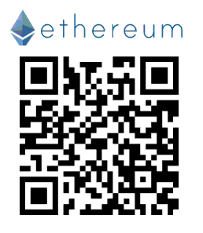
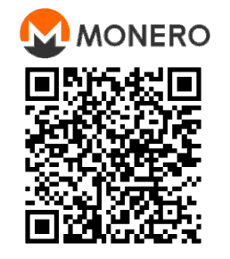

[国内收款方式↓](#收款方式)

### Global Receiving Addresses

#### Ethereum (ETH)



```
0xb1c1269Da156D969C663F6C400dbC62218b48F21
```

#### Monero (XMR)

 

```
83SgTF94F9BLVSLocs2Zy81wfVCzYqkyTCzdGm2JfGiyAig7nG5HH9YWQszVBsYXsqezpfdKkJUSoYDCmmW5XN9ABgjtnFY
```


### 收款方式

> 如果图片无法显示，请移步[这里](https://gitlab.com/garywill/receiving/-/blob/master/receiving_methods.md)

先领个支付宝红包吧


或支付宝搜索 `535199076` 领红包

#### 支付宝


https://qr.alipay.com/fkx0223149wd5wmc3c4tb81

#### 微信


[wxp://f2f0gHGUeiWaI2FVtac3ZKapZaVFBgUVo2Is](wxp://f2f0gHGUeiWaI2FVtac3ZKapZaVFBgUVo2Is)
